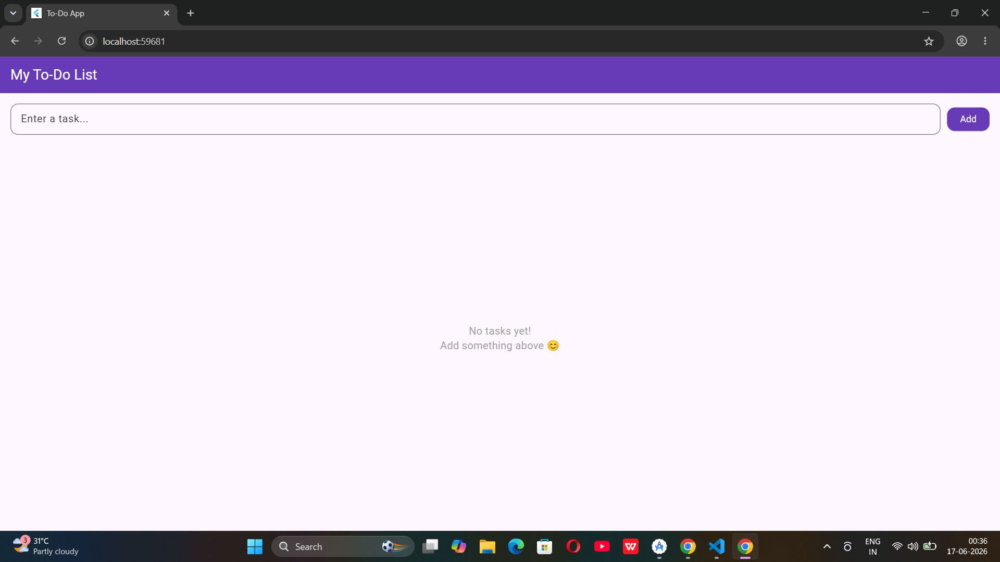
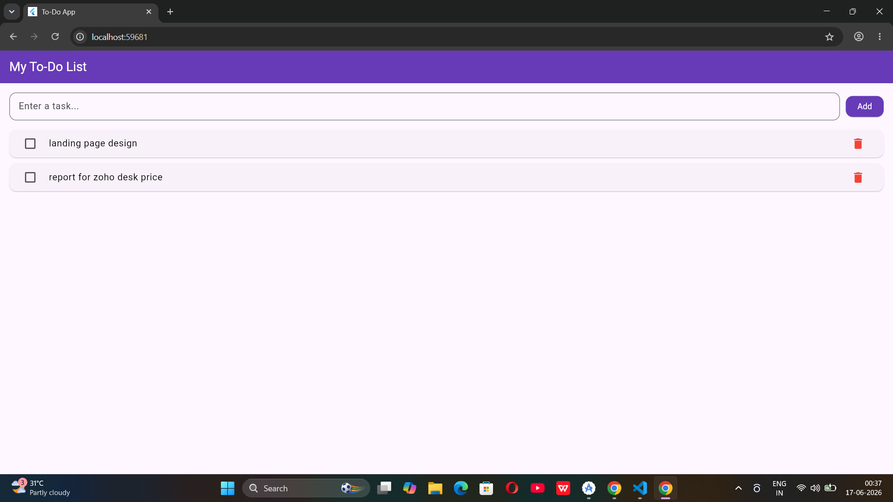

# Flutter To-Do App ✅

A simple and clean To-Do Task Manager built with Flutter.

## Screenshots

| Empty State | With Tasks |
|---|---|
|  |  |

## Features
- ➕ Add tasks
- ✅ Mark tasks as done
- 🗑️ Delete tasks
- Clean Material 3 UI

## How to Run

```bash
git clone https://github.com/swetha/flutter-todo-app.git
cd flutter-todo-app
flutter pub get
flutter run
```

## Tech Stack
- Flutter
- Dart
- Material 3

## Author
Swethamahesh552 — github.com/swethamahesh552